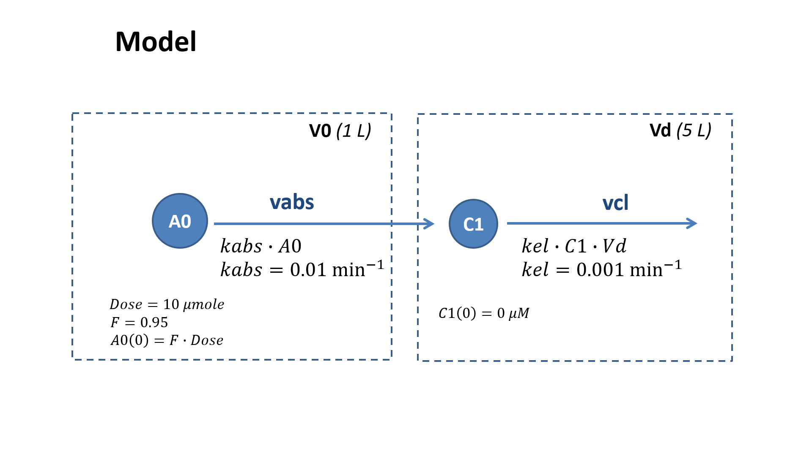

# Format comparison

This case describes different representation of the two compartment model.

See more details in **"Heta tutorial" #2**

## Figure



## Shortened Heta code without #update

file `index.heta`
```heta
// Heta with sugar
V0 @Compartment .= 1;
Vd @Compartment .= 5;

A0 @Species { compartment: V0, isAmount: true } .= F * Dose;
C1 @Species { compartment: Vd } .= 0;

vabs @Reaction { actors: A0 = C1 } := kabs * A0;
vel @Reaction { actors: C1 = } := kel * C1 * Vd;

kabs @Const = 0.01;
kel @Const = 1e-3;
F @Const = 0.95;
Dose @Const = 10;

#export { format: SBML, filepath: sbml_model };
```

```heta
// how to use the code
#include { source: index.heta,  type: heta };
```

## shortened Heta code with #update

file `index-upd.heta`
```heta
// Heta with sugar
V0 @Compartment .= 1;
Vd @Compartment .= 5;

A0 @Species { compartment: V0, isAmount: true };
A0 .= F * Dose; // implicit #update here
C1 @Species { compartment: Vd };
C1  .= 0; // implicit #update here

vabs @Reaction { actors: A0 = C1 };
vabs := kabs * A0; // implicit #update here
vel @Reaction { actors: C1 = };
vel := kel * C1 * Vd; // implicit #update here

kabs @Const = 0.01;
kel @Const = 1e-3;
F @Const = 0.95;
Dose @Const = 10;

#export { format: SBML, filepath: sbml_model };
```

```heta
// how to use the code
#include { source: index-upd.heta,  type: heta };
```

## Plain Heta code

file `index-plain.heta`
```heta
// Raw Heta
{ action: insert, class: Compartment, id: V0, assignments: { start_: 1 } };
{ action: insert, class: Compartment, id: Vd, assignments: { start_: 5 } };

{ action: insert, class: Species, id: A0, compartment: V0, assignments: { start_: F * Dose }, isAmount: true };
{ action: insert, class: Species, id: C1, compartment: Vd, assignments: { start_: 0 } };

{ action: insert, class: Reaction, id: vabs, actors: A0 = C1, assignments: { ode_: kabs * A0 } };
{ action: insert, class: Reaction, id: vel, actors: C1 =, assignments: { ode_: kel * C1 * Vd } };

{ action: insert, class: Const, id: kabs, num: 0.01 };
{ action: insert, class: Const, id: kel, num: 1e-3 };
{ action: insert, class: Const, id: F, num: 0.95 };
{ action: insert, class: Const, id: Dose, num: 10 };

{ action: export, format: SBML, filepath: sbml_model };
```

```heta
// how to use the code
#include { source: index-plain.heta,  type: heta };
```

## JSON format

file `index-json.json`
```json
[
  { "action": "insert", "class": "Compartment", "id": "V0", "assignments": { "start_": 1 } },
  { "action": "insert", "class": "Compartment", "id": "Vd", "assignments": { "start_": 5 } },
  
  { "action": "insert", "class": "Species", "id": "A0", "compartment": "V0", "assignments": { "start_": "F * Dose" }, "isAmount": true },
  { "action": "insert", "class": "Species", "id": "C1", "compartment": "Vd", "assignments": { "start_": 0 } },
  
  { "action": "insert", "class": "Reaction", "id": "vabs", "actors": "A0 = C1", "assignments": { "ode_": "kabs * A0" } },
  { "action": "insert", "class": "Reaction", "id": "vel", "actors": "C1 =", "assignments": { "ode_": "kel * C1 * Vd" } },
  
  { "action": "insert", "class": "Const", "id": "kabs", "num": 0.01 },
  { "action": "insert", "class": "Const", "id": "kel", "num": 1e-3 },
  { "action": "insert", "class": "Const", "id": "F", "num": 0.95 },
  { "action": "insert", "class": "Const", "id": "Dose", "num": 10 },
  
  { "action": "export", "format": "SBML", "filepath": "sbml_model" }
]
```

```heta
// how to use the code
#include { source: index-json.json,  type: json };
```

## YAML format

file `index-yaml.yml`
```yml
- action: insert
  class: Compartment
  id: V0
  assignments: { start_: 1 }
- action: insert
  class: Compartment
  id: Vd
  assignments: { start_: 5 }
- action: insert
  class: Species
  id: A0
  compartment: V0
  assignments: { start_: F * Dose }
  isAmount: true
- action: insert
  class: Species
  id: C1
  compartment: Vd
  assignments: { start_: 0 }
- action: insert
  class: Reaction
  id: vabs
  actors: A0 = C1
  assignments: { ode_: kabs * A0 }
- action: insert
  class: Reaction
  id: vel
  actors: C1 =
  assignments: { ode_: kel * C1 * Vd }
- action: insert
  class: Const
  id: kabs
  num: 0.01
- action: insert
  class: Const
  id: kel
  num: 1e-3
- action: insert
  class: Const
  id: F
  num: 0.95
- action: insert
  class: Const
  id: Dose
  num: 10
- action: export
  format: SBML
  filepath: sbml_model
```

```heta
// how to use the code
#include { source: index-yaml.yml,  type: yaml };
```

## Table format

file: `table.xlsx`

| action | class | id | assignments.start_ | assignments.ode_ | num | compartment |isAmount | actors | format | filepath |
|---|---|---|---|---|---|---|---|---|---|---|
| insert | Compartment | V0 | 1 |
| insert | Compartment | Vd | 5 |
| insert | Species | A0 | F * Dose | | | V0 | true |
| insert | Species | C1 | 0 | | | Vd | |
| insert | Reaction | vabs | | kabs * A0 | | | | A0 = C1 |
| insert | Reaction | vel | | kel * C1 * Vd | | | | C1 = |
| insert | Const | kabs | | | 0.01 |
| insert | Const | kel | | | 1e-3 |
| insert | Const | F | | | 0.95 |
| insert | Const | Dose | | | 10 |
| export | | | | | | | || SBML | sbml_model |

```heta
// how to use the code
#include { source: table.xlsx,  type: xlsx };
```
