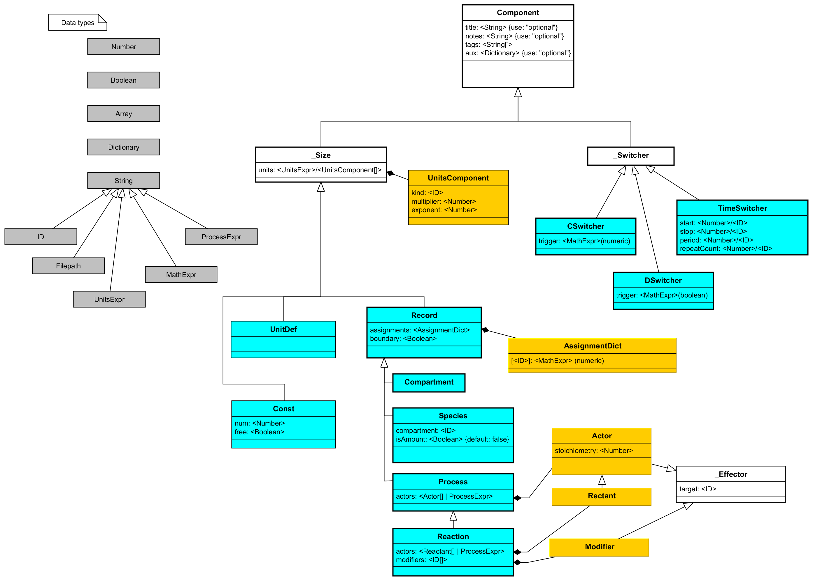

# Heta classes

Heta classes describes hierarchical types of Heta components. Abstract classes (classes without instances) denoted by underscore before the first symbol.

## Class list

- [_Component](#_component)
- [Page](#page)
- [UnitDefinition](#unitdefinition)
- [FunctionDefinition](#functiondefinition)
- [Record](#record)
- [Process](#process)
- [Compartment](#compartment)
- [Species](#species)
- [Reaction](#reaction)
- [_Switcher](#switcher)
- [TimeSwitcher](#timeswitcher)
- [ContinuousSwitcher](#continuousswitcher)
- [SimpleTask](#simpletask)
- [_Export](#_export)
- [SBMLExport](#sbmlexport)
- [SLVExport](#slvexport)
- [MrgsolveExport](#mrgsolveexport)
- [SimbioExport](#simbioexport)
- [JSONExport](#jsonexport)
- [YAMLExport](#yamlexport)

## String types
- [ID](#id)
- [UnitsExpr](#unitsexpr)
- [ProcessExpr](#processexpr)
- [MathExpr](#mathexpr)

## UML diagram

[](./heta.uml.png)

## Basics

1. Classes define the properties of their instances, their types checking rules and the default values. Trying to include the undeclarated properties is not an error but will be ignored.
    ```heta
    pr1 @Process { compartment: comp1 };
    ```
    will be interpreted as 
    ```heta
    pr1 @Process { };
    ```
    because `compartment` property is not declared for `Process` class.

1. There are some specific checking rules in classes, e.g. required properties. They will be checked only after all components from the code is loaded, see [workflow](./workflow). For example, `Const` class has required numeric property `num`:
    ```heta
    k1 @Const; // thes case doesn't throw error
    k1 { num: 1 };    // because num property is set here
    ```

1. Some properties of the components are the references to other components, furthermore they should be referenced to instances of specific classes. The checking of references will be after loading all the code. For example a `Species` instance must have the property `compartment` which is the reference to a `Compartment` instance.
    ```heta
    S @Species { compartment: comp1 } .= 0;
    ```
    The code above throws an error because there is no element with id `comp1`.
    ```heta
    S @Species { compartment: comp1 } .= 0;
    comp1 @Compartment .= 1;
    ```
    The code above is OK because for the moment of reference checking the compartment has already been loaded.

1. `_Component` is the top class, i.e. all other Heta components inherits from `_Component`. 

## _Component

**Parent:** *no*

This is top class for all Heta components. Includes properties for component annotation.

| property | type | required | default | ref | description | 
| ---------|------|----------|---------|-----|-------------|
| title | string | | | | Additional non-unique human readable identifier for a component. |
| notes | string | | | | Arbitrary text for component annotation. It can potentially support markdown for text decoration. |
| tags | string[] | | [ ] | | Array of strings tagging components. Can be used for grouping components. |
| aux | object | | { } | | User defined auxilary structures { key: value pair } with any complexity. This can be used to store additional information and annotation. |

## Const

**Parent:** [_Component](#_Component)

This is class for numerical values which do not change in simulation time.

| property | type | required | default | ref | description | 
| ---------|------|----------|---------|-----|-------------|
| num | number | true | | | Numerical value or starting value for identification. |
| free | boolean | | | | If true the constant is unknown and can be evaluated based on experimental data.|
| units | UnitsExpr | | | | String in specific [UnitsExpr](#unitsexpr) syntax. |

### Example
```heta
''' Absorption constant describing transport from **GUT** to **BLOOD** '''
kabs @Const 'Constant of absorption' {
    tags: ['pk', 'human'],
    aux: { references: { 
            pmid: [ 11111111, 22222222 ], 
            wiki: ['Pharmacokinetics#Compartmental_analysis'] 
    }}
};
kabs = 1.4e-6 { free: true, units: 1/h };
```

## Page

**Parent:** [_Component](#_Component)

This is class for any arbitrary text page which can be helpful for the whole platform annotation or documentation writing.

| property | type | required | default | ref | description | 
| ---------|------|----------|---------|-----|-------------|
| content | string | true | | | Any arbitrary text with markdown. |

### Example

```heta
pg_authors @Page 'Authors' { content: "
    This platform was developed by:
    - Vasily Pupkin;
    - Viktor Pipiskin;
"};
```

## UnitDefinition

**Parent:** [_Component](#_Component)

This is class for implementation of a definition of unit to use it in [UnitsExpr](#unitsexpr).

| property | type | required | default | ref | description | 
| ---------|------|----------|---------|-----|-------------|
| components | UnitDefinitionComponent[] | true | [] | | Array of objects, representing multiplyers to create a new unit. |


### Example
```heta
''' kDa = (1e3*g)^1 * (1*mole)^-1 '''
kDa @UnitDefinition { components: [
    { kind: g, multiplier: 1e3, exponent: 1 },
    { kind: mole, exponent: -1 }
]};
```

### UnitDefinitionComponent

**Parent:** *none*

| property | type | required | default | ref | description | 
| ---------|------|----------|---------|-----|-------------|
| kind | ID | true | | UnitDefinition | The reference id to the default set of UnitDefinitions |
| multiplier | numeric | true | 1 | | Multiplier |
| exponent | numeric | true | 1 | | Power |

## FunctionDefinition

**Parent:** [_Component](#_Component)

This is class describing user defined mathematical functions. See [MathExpr](#mathexpr).

| property | type | required | default | ref | description | 
| ---------|------|----------|---------|-----|-------------|
| args | string[] | | [] | | Array of function arguments. |
| expr | string | true | | | Math epression describing the function.|

### Example

```heta
logit10 @FunctionDefinition {
    args: [x],
    expr: log10(x / (1 - x))
};
```

## Record

**Parent:** [_Component](#_component)

Record instances describes the dynamic values (variable) which can be changed in time. Usually Record has the physical or biologycal meaning. The value changes their value by assignment at specific points (switchers) or by `Process` instances.

| property | type | required | default | ref | description | 
| ---------|------|----------|---------|-----|-------------|
| assignments | object | | | | Dictionary of assignments where key is switcher id and value describes the MathExpr |
| units | UnitsExpr | | | | String in specific [UnitsExpr](#unitsexpr) syntax. |
| boundary | boolean | | | | If `true` the value describing `Record` cannot be changed by `@Process` instances. |

### Example

```heta
p1 @Record { boundary: true, units: kg/L };
p1 .= x*y;
p1 [sw1]= 0;

// equivalent to this code
/*
p1 {
    class: Record.
    boundary: true,
    units: kg/L,
    assignments: {
        start_: x*y,
        sw: 0
    }
};
*/
```

### Assignment dictionary

Assignment dictionary describes a set of assignments which is used to change the `Record` value directly. The keys corresponds to existed switchers id or default switcher like start_, ode_.

| property | type | required | default | ref | description | 
| ---------|------|----------|---------|-----|-------------|
| [switcherId] | string/number/object | true | | | [MathExpr](#mathexpr) or number or object in format { expr: \<MathExpr\> } |

## Process

**Parent:** [Record](#record)

Process instances changes the other `Record` instances indirectly through the ordinary differential equations. Process is like flux that increase or decrease values over time.

| property | type | required | default | ref | description | 
| ---------|------|----------|---------|-----|-------------|
| actors | Actor[]/string | | [] | | [ProcessExpr](#processexpr) or array of objects of format.  { target: \<ID\>, stoichiometry: \<number\> }. The rules for dynamic components which describes how they will be included to ODE including stoichiometry. |

### Example

```heta
pr1 @Process { actors: p1 => 2*p2 };

/* equivalent to 
pr1 @Process { actors: [
    { target: p1, stoichiometry: -1 },
    { target: p2, stoichiometry: 2 }
]};
*/
```

### Effector

**Parent:** *none*

| property | type | required | default | ref | description | 
| ---------|------|----------|---------|-----|-------------|
| target | ID | true | | `Record` | Reference to record |

### Actor

**Parent:** [Effector](#effector)

| property | type | required | default | ref | description | 
| ---------|------|----------|---------|-----|-------------|
| stoichiometry| number | | 1 |  | Stoichiometry of flux. |

## Compartment

**Parent:** [Record](#record)

`Compartment` is class describing volumes where `Species` instances are located. The variable means the volume size.

*no specific properties*

### Example
```heta
comp1 @Compartment = 5.3 { units: L };
```

## Species

**Parent:** [Record](#record)

`Species` is class describing molecules in some location. The variable value can mean amount of molecules or concentration depending on `isAmount` property.

| property | type | required | default | ref | description | 
| ---------|------|----------|---------|-----|-------------|
| compartment | ID | true | | `Compartment` | Reference to compartment id where the molecule is located. |
| isAmount | boolean | | | | If `true` the value is an amount not concentration. |

### Example

```heta
S @Species {
    compartment: comp1,
    isAmount: false
};
S .= 10;
```

## Reaction

**Parent:** [Process](#process)

The same as Process, but all target references should be Species.

| property | type | required | default | ref | description | 
| ---------|------|----------|---------|-----|-------------|
| actors | Reactant[]/string | | [] | | [process string](#process-string) or array of objects in format { target: \<ID\>, stoichiometry: \<number\> where target is the reference to `Species`} |
| modifiers | Modifiers[] / ID[] | | [] | | List of references to `Species`. Array of references or array of objects in format {target: \<ID\>}. set of components which are not included to ODE but can affect to it. |

### Example

```heta
r1 @Reaction {
    actors: S -> P,
    modifiers: [ E ]
};
r1 := k1*A*comp1;
```

## _Switcher

**Parent:** [_Component](#_component)

*no specific properties*

## TimeSwitcher

**Parent:** [_Switcher](#_switcher)

| property | type | required | default | ref | description | 
| ---------|------|----------|---------|-----|-------------|
| start | number | true | | | first switch |
| period | number | | | | > 0 |
| repeatCount | number | | 0 | | >= 0 |

### Example

```heta
sw1 @TimeSwitcher {
    start: 0,
    period: 24,
    repeatCount: 4
}; 
```
## ContinuousSwitcher

**Parent:** [_Switcher](#_switcher)

This is **scoped** class.

| property | type | required | default | ref | description | 
| ---------|------|----------|---------|-----|-------------|
| condition | ID | true | | `Record` |  |

### Example

```heta
sw2 @ContinuousSwitcher {
    condition: evt1
};
```

## SimpleTask

**Parent:** [_Component](#_component)

| property | type | required | default | ref | description | 
| ---------|------|----------|---------|-----|-------------|
| subtasks | Subtask[] | true | | | Array of elements of type {saveat: \<number[]\>, output: \<string[]\>} |
| tspan | number[] | | [0, 100] | | start and end point of simulation |
| reassign | Dictionary | | {} | `Const` | reassignments of constants for the simulation |
| solver.alg | string | | lsode | | method |
| solver.reltol | number | | 1e-6 | | relative tolerance |
| solver.abstol | number | | 1e-6 | | absolute tolerance |
| solver.maxiters | number | | 1e5 | | maximum number of iteretions |
| solver.dt | number | | 0 | | dt value |
| solver.dtmin | number | | 0 | | dtmin value |
| solver.dtmax | number | | 0 | | dtmax value |
| solver.tstops | number[] | | [] | |time points for force stop |

### Example

```heta
st1 @SimpleTask {
    subtasks: [
        { saveat: [0, 10, 100], output: [A, B, C] }
    ],
    tspan: [0, 120],
    reassign: { p1: 10, p2: 0 },
    solver: {
        alg: lsoda,
        abstol: 1e-9
    }
};
```

## _Export

**Parent:** [_Component](#_Component)

This is top class for the components describing transformations to other modeling formats: SBML, Simbiology, etc.

*No additional properties.*

## SBMLExport

**Parent:** [_Export](#_export)

Export to SBML format.

| property | type | required | default | ref | description | 
| ---------|------|----------|---------|-----|-------------|
| version | string | | L2V4 | | SBML version. One of the values: `L2V1`, `L2V3`, etc. |
| skipRefChecking | boolean | | | | `true` means that the model builder will ignore reference errors |

## SLVExport

**Parent:** [_Export](#_export)

Export to SLV format (DBSolveOptimum).

| property | type | required | default | ref | description | 
| ---------|------|----------|---------|-----|-------------|
| eventsOff | boolean | | | | if `eventsOff = true` the switchers will be ignored in export. |

## MrgsolveExport

**Parent:** [_Export](#_export)

Export to mrgsolve model format (cpp file).

| property | type | required | default | ref | description | 
| ---------|------|----------|---------|-----|-------------|
*No additional properties.*

## SimbioExport

**Parent:** [_Export](#_export)

Export to Simbiology/Matlab code (m file). The code can be run to create simbiology project.

| property | type | required | default | ref | description | 
| ---------|------|----------|---------|-----|-------------|
*No additional properties.*

## JSONExport

**Parent:** [_Export](#_export)

Export to JSON structure (array) representing the content of platform. The structure of elements corresponds to [action sequence](workflow) format.

| property | type | required | default | ref | description | 
| ---------|------|----------|---------|-----|-------------|
*No additional properties.*

## YAMLExport

**Parent:** [_Export](#_export)

Export to YAML structure (array) representing the content of platform. The structure of elements corresponds to [action sequence](workflow) format.

| property | type | required | default | ref | description | 
| ---------|------|----------|---------|-----|-------------|
*No additional properties.*

## ID

ID describes the string type which is used for idexing Heta components. ID type can be used for namespaces, identifiers and references.

The rules for ID is the following:

1. First symbol should be letter or underscore.
1. Second and other elements should be letter, number or underscore.
1. Deprication: the last symbol should not be underscore.

### Example

**Corect ID:** `"x"`, `"x12"`, `"x_12"`, `"_12"`, `"x___12"`

**Wrong ID:** `"12x"`, `"x-12"`, `"x 9"`

**Depricated ID:** `"_"`, `"x12_"`

## UnitsExpr

UnitsExpr strings represent the complex units combined from the predefined unit IDs. Available operatators: `*`, `/`, `^`, `1/`.

### Example

**Correct UnitsExpr**: `mg`, `g/mole`, `1/h`, `kg/m2`, `kg/m^2`

**Wrong UnitsExpr:** `g/(mole*L)`, `5*g`, `km + kg`

## ProcessExpr

ProcessExpr is string representing process stoichiometry. The "arrow" syntax (`->`, `<->`, `=>`, `<=>`) devided two parts: influx (left) and outflux (right). Plus symbol divide two or more actors. Stoichiometry coefficients are shown by numbers before reference. Asterix symbol is optional.

### Example

**Correct ProcessExpr**: `A->B`, `A =>`, `2A <=> 3*B + C`.

## MathExpr

Mathematical expressions in string format. Available operators: `+`, `-`, `*`, `/`, `^`. See detailes in [Math expressions](./math)

## Example

**Correct MathExpr:** `x*y*pow(x,y)`
