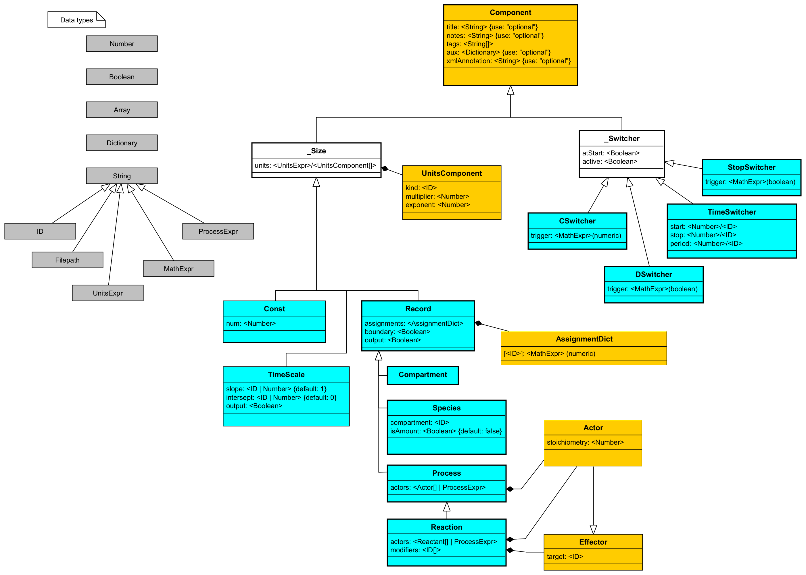

# Heta classes

Heta classes describes hierarchical types of Heta components. Abstract classes (classes without instances) denoted by underscore before the first symbol.

## Class list

- [_Simple](#_Simple)
- [_Scoped](#_Scoped)
- [Page](#Page)
- [UnitDefinition](#UnitDefinition)
- [FunctionDefinition](#FunctionDefinition)
- [_Export](#_Export)
- [SBMLExport](#SBMLExport)
- [Record](#Record)
- [Process](#Process)
- ~~[Compartment](#Compartment)~~
- ~~[Species](#Species)~~
- ~~[Reaction](#Reaction)~~
- ~~[_Switcher](#Switcher)~~
- ~~[TimeSwitcher](#TimeSwitcher)~~
- ~~[ContinuousSwitcher](#ContinuousSwitcher)~~
- ~~[SimpleTask](#SimpleTask)~~

## String types list
- ~~[idString](#idString)~~
- ~~[units expression](#units-expression)~~
- ~~[math expression](#math-expression)~~
- ~~[process expression](#process-expression)~~

## Basics

1. Classes describes the available properties of their instances, their types checking rules and the default values. Trying to include the undeclarated properties is not an error but just will be ignored.
    ```heta
    one::pr1 @Process { compartment: comp1 };
    ```
    will be interpreted as 
    ```heta
    one::pr1 @Process { }; // because compartment property is not declared for @Process
    ```

1. There are some specific checking rules in classes, e.g. required properties. They will be checked only after all components from the code is loaded, see [workflow](./workflow). For example, `@Const` class has required numeric property `num`:
    ```heta
    k1 @Const; // thes case doesn't throw error
    k1 = 1;    // because num property is set later
    ```

1. Some properties of the components are the references to other components, furthermore they should be referenced to instances of specific classes. The checking of references will be after loading all the code. For example `@Species` class must have the property compartment which is the reference to a `@Compartment` instance.
    ```heta
    one::S @Species { compartment: comp1 } .= 0;
    ```
    The code above throws an error because there is no element with id `comp1` in `one` namespace.
    ```heta
    one::S @Species { compartment: comp1 } .= 0;
    one::comp1 @Compartment .= 1;
    ```
    The code above is OK because for the moment of reference checking the compartment has already been loaded.

1. The current version of Heta language uses classes the instances of which can be associated with either global (anonimous) or local [namespace](./namespaces). For example `@Const` class instances can be only global (**unscoped class**). The direct indication of namespace is not the error, but the namespace will be anonimous.
    ```heta
    x @Const = 1;
    nmsps1::y @Const = 0;
    ```
    will be interpreted as
    ```heta
    x @Const = 1;
    y @Const = 0;
    ```
    Component of **scoped class** like `@Compartment` must have namespace indicated directly or by namespace block. Zero namespace throws an error.
    ```heta
    nmsps1::comp1 @Compartment; // OK
    comp1 @Compartment; // throws error
    ```

1. `_Simple` is the top class, i.e. all other Heta classes inherits from `_Simple`. 


## _Simple

**Parent:** *no*

This is top class for all Heta components. Includes properties for component annotation.

This is **unscoped** and **abstract** class.

| property | type | required | default | ref | description | 
| ---------|------|----------|---------|-----|-------------|
| title | string | | | | Additional human readable name for a component. |
| notes | string | | | | Arbitrary text for Element annotation. Support markdown for text decoration. |
| tags | string[] | | [ ] | | Array of strings tagging components. Can be used for grouping components. |
| aux | object | | | | User defined auxilary structures (key:value) with any complexity. This can be used to store additional information and annotation. |

## _Scoped

**Parent:** [_Simple](#_simple)

This is top class for all scoped components.

This is **scoped** and **abstract** class.

*No additional properties.*

## Const

**Parent:** [_Simple](#_simple)

This is class for numerical values which do not change in simulation time.

This is **unscoped** class.

| property | type | required | default | ref | description | 
| ---------|------|----------|---------|-----|-------------|
| num | number | true | | | Numerical value or starting value for identification. |
| free | boolean | | | | If true the constant is unknown and can be evaluated based on experimental data.|
| units | string | | | | String in specific [units expression](#units-expression) syntax. |

### Example
```heta
''' Absorption constant describing transport from **GUT** to **BLOOD** '''
kabs @Const 'Constant of absorption' {
    tags: ['pk', 'human'],
    aux: { references: { 
            pmid: [ 11111111, 22222222 ], 
            wiki: ['Pharmacokinetics#Compartmental_analysis'] 
    }}
};
kabs = 1.4e-6 { free: true, units: 1/h };
```

## Page

**Parent:** [_Simple](#_simple)

This is class for any arbitrary text page which can be helpful for the whole platform annotation or documentation writing.

This is **unscoped** class.

| property | type | required | default | ref | description | 
| ---------|------|----------|---------|-----|-------------|
| content | string | true | | | Any arbitrary text with markdown. |

### Example

```heta
pg_authors @Page 'Authors' { content: "
    This platform was developed by:
    - Vasily Pupkin;
    - Viktor Pipiskin;
"};
```

## UnitDefinition

**Parent:** [_Simple](#_simple)

This is class for implementation of a definition of unit to use it in [units expression](#units-expression).

This is **unscoped** class.

| property | type | required | default | ref | description | 
| ---------|------|----------|---------|-----|-------------|
| components | UnitDefinitionComponent[] | true | [] | | Array of objects, representing multiplyers to create a new unit. |


### Example
```heta
''' kDa = (1e3*g)^1 * (1*mole)^-1 '''
kDa @UnitDefinition { components: [
    { kind: g, multiplier: 1e3, exponent: 1 },
    { kind: mole, exponent: -1 }
]};
```

### UnitDefinitionComponent

**Parent:** *none*

| property | type | required | default | ref | description | 
| ---------|------|----------|---------|-----|-------------|
| kind | string | true | | UnitDefinition | The reference id to the default set of UnitDefinitions |
| multiplier | numeric | true | 1 | | Multiplier |
| exponent | numeric | true | 1 | | Power |

## FunctionDefinition

**Parent:** [_Simple](#_simple)

This is class describing user defined mathematical functions. See [math expression](#math-expression).

This is **unscoped** class.

| property | type | required | default | ref | description | 
| ---------|------|----------|---------|-----|-------------|
| args | string[] | | [] | | Array of function arguments. |
| expr | string | true | | | Math epression describing the function.|

### Example

```heta
logit10 @FunctionDefinition {
    args: [x],
    expr: log10(x / (1 - x))
};
```

## _Export

**Parent:** [_Simple](#_simple)

This is top class for the components describing transformations to other modeling formats: SBML, Simbiology, etc.

This is **unscoped** and **abstract** class.

*No additional properties.*

## SBMLExport

**Parent:** [_Export](#_Export)

Export to SBML format.

This is **unscoped** class.

| property | type | required | default | ref | description | 
| ---------|------|----------|---------|-----|-------------|
| version | string | | L2V4 | | SBML version. One of the values: `L2V1`, `L2V3`, etc. |
| model | string | true | | | namespace id to create the SBML model |
| skipMathChecking | boolean | | | | `true` means that the model builder will not check math expressions |

## Record

**Parent:** [_Scoped](#_Scoped)

Record instances describes the dynamic values (variable) which can be changed in time. The value changes their value by assignment at specific points (switchers) or by `Process` instances.

This is **scoped** class.

| property | type | required | default | ref | description | 
| ---------|------|----------|---------|-----|-------------|
| assignments | object | | | | Dictionary of assignments where key is switcher id and value describes the math expression |
| units | units | string | | | | String in specific [units expression](#units-expression) syntax. |
| boundary | boolean | | | | If `true` the value describing `Record` cannot be changed by `@Process` instances. |

### Example

```heta
one::p1 @Record { boundary: true, units: kg/L };
one::p1 .= x*y;
one::p1 [sw1]= 0;

// equivalent to this code
/*
one::p1 {
    class: Record.
    boundary: true,
    units: kg/L,
    assignments: {
        start_: x*y,
        sw: 0
    }
};
*/
```

### Assignment dictionary

Assignment dictionary describes a set of assignments which is used to change the `Record` value directly. The keys corresponds to existed switchers id or default switcher like start_, ode_.

| property | type | required | default | ref | description | 
| ---------|------|----------|---------|-----|-------------|
| [switcherId] | string/number/object | true | | | [math expression](#math-expression) or number or object in format { expr: \<math expression\> } |

## Process

**Parent:** [Record](#Record)

Process instances changes the other `Record` instances indirectly through the ordinary differential equations. Process is like flux that increase or decrease values over time.

This is **scoped** class.

| property | type | required | default | ref | description | 
| ---------|------|----------|---------|-----|-------------|
| actors | Actor[]/string | | [] | | [process expression](#process-expression) or array of objects of format { target: \<string\>, stoichiometry: \<number\> } |

### Example

```heta
one::pr1 @Process { actors: p1 => 2*p2 };

/* equivalent to 
one::pr1 @Process { actors: [
    { target: p1, stoichiometry: -1 },
    { target: p2, stoichiometry: 2 }
]};
*/
```

### Effector

**Parent:** *none*

| property | type | required | default | ref | description | 
| ---------|------|----------|---------|-----|-------------|
| target | string | true | | `Record` | Reference to record |

### Actor

**Parent:** [Effector](#Effector)

| property | type | required | default | ref | description | 
| ---------|------|----------|---------|-----|-------------|
| stoichiometry| number | true | |  | Stoichiometry of flux. |

## UML diagram

[](./heta.uml.png)
