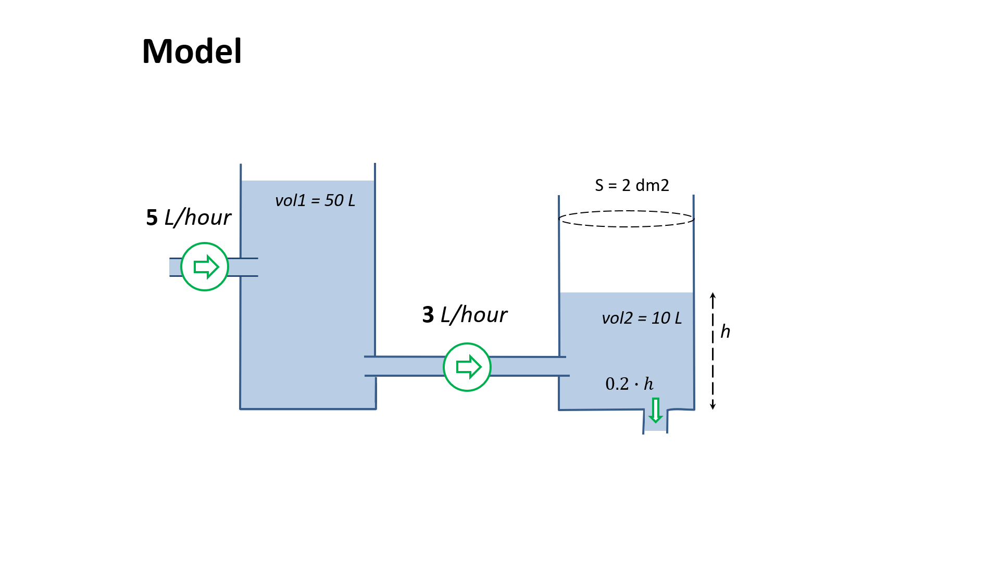

# Tanks and pipes

A dynamic model without compartments and species.

See more details in **"Heta tutorial" #3**

## Figure


## Code

```heta
vol1 @Record .= 50;
vol2 @Record .= 10;

flux1 @Process { actors: = vol1 } := 2;
flux2 @Process { actors: vol1=vol2 } := vol1 >= 10 ? 3 : vol1*0.3;
flux3 @Process { actors: vol2= } := k_out * h;

h @Record := vol2 / S;
S @Const = 2;
k_out @Const = 0.1;
```
