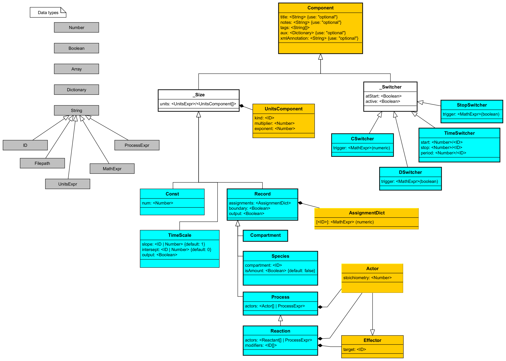

# Heta classes

Heta classes define the hierarchical types of components within the Heta modeling language.
These components form the building blocks of a model, with each class specifying the properties,
validation rules, and behaviors associated with its instances.

## Class List

- [Component](#component)
- [_Size](#_size)
- [TimeScale](#timescale)
- [Const](#const)
- [Record](#record)
- [Process](#process)
- [Compartment](#compartment)
- [Species](#species)
- [Reaction](#reaction)
- [_Switcher](#_switcher)
- [TimeSwitcher](#timeswitcher)
- [DSwitcher](#dswitcher)
- [CSwitcher](#cswitcher)
- [StopSwitcher](#stopswitcher) (experimental)

## UML diagram

The Heta class structure is visualized in the UML diagram below. This diagram illustrates the relationships
 and inheritance hierarchy between the classes.

[]( ':ignore')

## About Heta Classes

Key concepts covered in this document include:
- **Hierarchical Class Structure:** All Heta components inherit properties and behaviors from the root `Component` class.
- **Property Validation:** Classes enforce specific rules for required properties, data types, and default values.
- **References:** Some classes require references to other components, which are checked during model compilation.
- **Usage** Meaning of classes in the framwork of a model, and how to use each class and how it affects the model.
- **Examples** Each class is accompanied by examples to illustrate its application.

Key aspects of Heta classes:

1. **Property Validation:**
   - Each class has a predefined set of properties. Declaring a property that is not defined for the 
        class is not considered an error, but the property will be ignored during compilation.
   - Example: `compartment` is not a valid property of the `Process` class, so it will be ignored
     ```heta
     pr1 @Process { compartment: comp1 };
     ```

2. **Required Properties:**
   - Some classes enforce specific required properties. These properties are validated after all
        components in the code have been loaded.
   - Example: The `Const` class requires the numeric property `num`, it must be defined somewhere for the instance to be valid.
     ```heta
     k1 @Const; // This does not throw an error at this stage
     k1 = 1;    // Adding the required property completes the definition to avoid errors
     ```
   - The required properties may be skipped if the compartment belongs to the [`abstract namespace`](./namespaces)
     because the this step is not applied for them.
   - Example: You can skip the required properties for the `Species` class if the compartment belongs to the abstract namespace.
     ```heta
     abstract namespace A begin
        // we do not set neither `assignments.start_` nor `assignments.ode_` here
        S1 @Species { compartment: c1 }; 
     end
     ```

3. **References:**
   - Certain properties must reference other components within the same namespace, 
     and these references are validated after the entire model is loaded.
   - Example: A `Species` instance must include the `compartment` property, which refers to a `Compartment` instance:
     ```heta
     S @Species { compartment: c1 } .= 0; // Throws an error if c1 is not defined or c1 is not a Compartment
     c1 @Compartment .= 1; // Adding the compartment resolves the reference
     ```

4. **Class Hierarchy:**
   - `Component` is the root class from which many other Heta classes inherit.
     This hierarchical structure allows shared properties and behaviors to propagate across classes.

5. **Abstract classes**
    - Some classes are "abstract" and cannot be instantiated directly. They serve as base classes for other classes and provide common properties and behaviors.
    - Example: `_Size` is an abstract class that defines properties related to units. It is inherited by classes like `TimeScale`, `Const`, `Record`, etc.

6. **Syntax remarks**
    - Certain properties in Heta classes, such as `title` and `notes`, support shorthand (syntax sugar) for concise and readable declarations.
    - See more in the [Syntax](./syntax) section.

## Component

**Parent:** None  

The `Component` class is the root class for other Heta components. The properties are primarily used for annotating and organizing model components.

### Properties

| Property       | Type      | Required | Default | Syntax Shorthand | Description                                             |
|----------------|-----------|----------|---------|--------------|---------------------------------------------------------|
| `id`           | ID        | Yes      |         |  `id`        | A unique identifier for the component withing the namespace. |
| `space`        | ID        |          | `nameless` |  `ns::`      | The namespace where the component is defined.           |
| `title`        | string    |          |         | `'Title'`   | A human-readable, non-unique identifier for the component. |
| `notes`        | string    |          |         | `'''Notes'''` | Arbitrary text used for annotation. Can optionally support Markdown for rich text. |
| `tags`         | string[]  |          | `[]`    |              | An array of tags for categorizing or grouping components. |
| `aux`          | object    |          | `{}`    |              | User-defined auxiliary data in key-value pairs. This can be used for storing custom annotations or metadata. |
| `xmlAnnotation`| string    |          |         |              | Additional annotation in XML format, compatible with SBML's `<Annotation>` tag. |

### Usage

- `Component` class is concrete, not abstract, and can be instantiated directly.
- It does not reflect any specific modeling concept but can be used store auxiliary information and metadata for some specific user's needs.
- `id` and `space` properties both form an unique index for the component in the model, read more in [namespaces](./namespaces) chapter.
- Default namespace is `nameless` and can be omitted in most cases.

### Examples

Create a simple component inside the default namespace:
```heta
'''This is a general description.'''
comp1 @Component 'Main Component' {
    tags: [example, annotation],
    aux: {
        metadata: { creator: John Doe, created: 2024-12-01 }
    },
    xmlAnnotation: "<Annotation><info>Example XML annotation</info></Annotation>"
};
```

Create a component in a custom namespace:
```heta
namespace A begin
    comp2 @Component 'Component 2';
end
```

Create a component in predefined namespace `A`:
```heta
A::comp3 @Component 'Component 3';
```

## _Size

**Parent:** [Component](#component)  

The `_Size` class is an abstract class that provides properties related to units. 
It serves as a base class for other components, such as `TimeScale`, `Const`, and `Record`, which require unit-related definitions.

More information about units can be found in the [Units](./units) section.

### Properties

| Property | Type | Required | Default  | Description |
|----------|------|----------|----------|-------------|
| `units`  | UnitsExpr or UnitsComponent[] | | | Specifies the units for the component. Can be a string describing the units or an array of `UnitsComponent` objects. |

### Usage

- as a abstract class the `_Size` cannot be instantiated directly.
- `units` property may have a specific requirements depending on the class, for example `TimeScale` requires writing the units in "time" scale like `hour`, `minute`, `second`, etc.
- `UnitsExpr` is a string that describes the units in shortened form, for more information see [Units](./units) section.

## UnitsComponent

**Parent:** None  

The `UnitsComponent` class defines a single component of a complex unit. It is used in the `units` property of components derived from `_Size` and in `units` property of [`#defineUnit`](./actions#defineunit) action.

### Properties

| Property     | Type     | Required | Default | Ref      | Description                                      |
|--------------|----------|----------|---------|----------|--------------------------------------------------|
| `kind`       | ID       | Yes      |         | UnitDef  | The reference ID to a predefined unit definition (e.g., `kg`, `L`). |
| `multiplier` | numeric  |      | 1       |          | A scaling factor applied to the unit.           |
| `exponent`   | numeric  |      | 1       |          | The power to which the unit is raised.          |

### Usage

- `UnitsComponent` is used to define complex units by combining multiple components.
- The array of `UnitsComponent` it is equivalent to the `UnitsExpr` but it represent its components in a more detailed, mashine-readable form.

### Examples

Define units for a `Record` component using `UnitsComponent`s:
```heta
p1 @Record {
    units: [
        { kind: litre, multiplier: 1, exponent: 1 },
        { kind: mole, multiplier: 1e-6, exponent: -1 }
    ]
};
```

This is equivalent to the following `UnitsExpr`:
```heta
p1 @Record { units: litre/(1e-6 mole) };
```

## TimeScale

**Parent:** [_Size](#_size)  

The `TimeScale` class represents an time variable.

### Properties

| Property    | Type    | Required | Default | Description                                           |
|-------------|---------|----------|---------|-------------------------------------------------------|
| `slope`     | number  |          | 1       | A fixed multiplier applied to the base time variable. |
| `intercept` | number  |          | 0       | A fixed offset added to the base time variable.       |
| `output`    | boolean |          |         | If `true`, the transformed time variable is available for output (e.g., plots, tables). |

### Usage

- `TimeScale` is used to define a transformation of the base time variable in a model.
- The `TimeScale` transformation is expressed as: `new_time = slope * t + intercept`
- The base time variable `t` is always available and is automatically initialized in the namespace.
- The base time t cannot be deleted but its units can be customized.
- In many cases, a `Record` component can be used to achieve the same functionality as `TimeScale`.

### Examples

Set units for default time scale:
```heta
t {units: second};
```

Define a custom time scale to use alternative time units (e.g., hours):
```heta
tih @TimeScale {
    slope: 2.78e-4, // 1 second / 1 hour = 2.78e-4
    intercept: 0,
    output: true,
    units: hour
};
```

This example defines a new time scale `tih` that transforms the base time variable `t` into hours.
```heta
tih @Record { output: true, units: hour } := 2.78e-4 * t;
```

## Const

**Parent:** [_Size](#_size)  

The `Const` class represents constant numerical values.

### Properties

| Property   | Type    | Required | Default  | Shorthand | Description                                                               |
|------------|---------|----------|----------|--------------|---------|
| `num`      | number  | Yes      |          | `= <number>` | The exact numerical value of the constant or its initial value for identification. |

### Usage

- `Const` instances are used to define fixed numerical values that do not change during the simulation.
- `Const` can be used in assignments or expressions, as well as be referenced by other components, like `period` property in `TimeSwitcher`.
- The instances are typically used as inputs to a model, such as parameters or coefficients.
- `Const` cannot be initialized with a mathematical expression, only with a number. Use `Record` or others for cases where the value is calculated.
- For components with biological meaning, such as Species, Compartment, or Reaction, it is best to use the corresponding class rather than `Const` to ensure good modeling practices. This improves model readability, self-explanatory structure, and future maintainability, avoiding the need to change classes if the value becomes variable later. Using the appropriate class also makes the model easier for others (or yourself) to update.

### Examples

Simple constant declaration:
```heta
k1 @Const {units: 1/h} = 1.4e-6;
```

Constants must be initialized with fixed numerical values only:
```heta
k2 @Const = 2 * k1; // This will throw an error
```

Wrong update of a constant value by switching:
```heta
k3 @Const = 1;
k3 [sw1]= 2;   // This statement will be ignored
```

## Record

**Parent:** [_Size](#_size)  

The `Record` class represents time-varying variables that can change over the course of a simulation. These variables often can be influenced by assignments and by `Process`/`Reaction` instances.

### Properties

| Property       | Type                     | Required | Default | Shorthand | Description    |
|----------------|--------------------------|----------|---------|--------------|----|
| `assignments`  | Dictionary{ID, MathExpr} |          |   `{}`      |     `.=`, `:=` or `[<sw>]=`  | A dictionary where each key is a switcher ID, and each value defines an expression to assign to the variable. |
| `boundary`     | boolean                  |          | `false` |              | If `true`, the variable is under boundary condition and will not change by `Process`/`Reaction` instances. |
| `output`       | boolean                  |          |         |              | If `true`, the variable is included in simulation outputs like plots or tables. |

### Usage

- The value of a `Record` within simulation time can change by:
    1. **By initial initialization**: `{assignments: {start_: <expression>}}`.
    1. **By rules**: `{assignments: {ode_: <expression>}}`.
    1. **Through `_Switcher`**: `{assignments: {<switcher_id>: <expression>}}`.
    1. **Indirectly by interactions with `Process`**
- `start_` assignment (`.=` shorthand ) is used to set the initial value of the variable. This value can be updated by a switcher or a process.
- If `ode_` assignment (`:=` shorthand) is defined the value will be updated at each time step by the given expression. So `start_` and switcher associated assignments will be ignored. Influence by `Process` and `Reaction` instances not affect the value in this case.
- At least on of `start_` or `ode_` assignments must be defined. If both are defined the `ode_` assignment will be used.
- The value of the variable can be changed at specific time points by using switchers. In that case the corresponding switcher reference must be defined in the `assignments` property. The shorthand notation `[<switcher_id>]=` is used for this purpose.
- The `Record` instances affected by `Process` or `Reaction` only if they are defined in the `actors` property.
- The `boundary` property equals `true` is used to set the variable as a boundary condition. It means that the value of the variable will not be changed by `Process` or `Reaction` instances even if it is defined in the `actors` property.
- For components with clear biological meaning, such as Species, Compartment (and corresponding units) you should use the corresponding class rather than `Record` to ensure good modeling practices. This improves model readability, self-explanatory structure, and future maintainability, avoiding the need to change classes if the value becomes variable later.
- If you need to use the value as input for a model, such as parameters or coefficients, it is better to use `Const` class.
- There is no restrictions on the units of the `Record` instances.

### Examples

Value initialized by initial value
```heta
p1 @Record;
p1 .= x * y; // same as p1 {assignments: {start_: x * y}};
```

Value initialized by rule
```heta
p2 @Record;
p2 := x * y; // same as p2 {assignments: {ode_: x * y}};
```

Value initialized by number as a initial value
```heta
p3 @Record .= 1; 
```

Value updated by switcher
```heta
p4 @Record .= 0;
p4 [sw1]= x * y; // same as p4 {assignments: {sw1: x * y}};
```

Wrong update rule by switcher
```heta
p5 @Record := 10;
p5 [sw1]= 2; // This statement will be ignored
```

Value updated by process
```heta
p6 @Record .= 0;
pr1 @Process { actors: => p6 };
```

Value under boundary condition, rule will not affect the value
```heta
p7 @Record { boundary: true } .= 0;
pr2 @Process { actors: => p7 };
```

Value under boundary condition can be updated by switcher
```heta
p8 @Record { boundary: true } .= 0;
p8 [sw1]= 2;
```

## Process

**Parent:** [Record](#record)  

The `Process` class represents fluxes that modify the values of other `Record` instances over time. Processes describe the dynamic interactions between components and are a key element in constructing system dynamics.

### Properties

| Property    | Type                  | Required | Default | Description |
|-------------|-----------------------|----------|---------|--------------|
| `actors`    | ProcessExpr or Actor[] |          | `[]`    | Defines the components affected by the process and their stoichiometries. |
| `reversible`| boolean               |          | `true`  | Indicates whether the process is reversible.                            |

### Usage

- `Process` instances define the interactions between components in a model. They act like fluxes that modify the values of other components stated in the `actors` property.
- The `actors` property specifies which `Record` instances are modified by the process and how (e.g., production, consumption, or transfer).
- By default, processes are reversible. This property can be explicitly set to `false` to model irreversible processes or shown in `ProcessExpr` by one of symbols: `=>, ->, >`.
- The `actors` property can be expressed as a `ProcessExpr` or an array of `Actor` objects.
- A shorthand notation `ProcessExpr` can be used (e.g., `A -> B`, `2A <-> B`, etc.) is used to describe actors.
- The `reversible` property do not affect the ODE simulations. It can be used for visualization or for compatibility with SBML's and SimBio's reversible attribute.
- If you set value in the `reversible` property, it will be used instead of the one defined in the `actors` property.
- You should use the rule based initialization for the `Process` rather than initial value or switcher based initialization.
- If no `actors` property is defined, the process will not affect any component and will work as a `Record`.
- You can set any units for the `Process` instances but should be consistent with the units of the affected components.
- `Process` does not affect the value of the `Record` instances under boundary condition, or initiated by `ode_` assignment (rules).
- If the components in actors are `Species` instances, the process should be defined in the `Reaction` class which is a specialized form of `Process` and have specific rules for the `Species` instances.

### Examples

Basic Process Declaration. Rate of `p1` decrease is equal to `2 * p2` increase.
```heta
pr1 @Process { actors: p1 => 2 * p2 };
pr1 := k1 * p1;
```

The above example is equivalent to:
```heta
pr1 @Process {
    actors: [
        { target: p1, stoichiometry: -1 },
        { target: p2, stoichiometry: 2 }
    ],
    reversible: false,
    assignments: { ode_: k1 * p1 }
};
```

Using reversible process by shorthand notation
```heta
pr2 @Process { actors: A <=> B };
```

Neutral `ProcessExpr` (neither reversible nor irreversible) result in default **reversible** process
```heta
pr3 @Process { actors: A = B };
```

`reversible` property rewrites the shorthand notation
```heta
pr4 @Process { actors: A <=> B, reversible: false };
```

Process does not affect the value of the `Record` instances under boundary condition
```heta
p1 @Record { boundary: true } .= 0;
p2 @Record .= 0;
pr5 @Process { actors: p1 => p2 } := k1 * p1; // not an error but p1 will always be 0
```

Process does not affect the value of the `Record` instances initiated by `ode_` assignment
```heta
p3 @Record := 10;
p4 @Record .= 0;
pr6 @Process { actors: p3 => p4 } := k1 * p3; // not an error but p3 will always be 10
```

## Effector

**Parent:** *none*

Auxiliary class to to be used as `modifiers` in the `Reaction` class.

| property | type | required | default | ref | description | 
| ---------|------|----------|---------|-----|-------------|
| target | ID | yes | | `Record` | Reference to record |

## Actor

**Parent:** [Effector](#effector)

Auxiliary class to define the effect of the `Process` on the `Record` instances and `Reaction` on the `Species` instances.

| property | type | required | default | ref | description | 
| ---------|------|----------|---------|-----|-------------|
| stoichiometry| number | | 1 |  | Stoichiometry of flux. |

## Compartment

**Parent:** [Record](#record)

`Compartment` is class describing volumes where `Species` instances are located. The variable means the volume size.

*No additional properties.*

### Usage

- `Compartment` are volumes where `Species` instances are dissolved or located.
- Each `Species` instance must be assigned to a `Compartment`, which defines its location. However, not all `Compartment` instances need to be referenced by a `Species`. It is possible to have Compartment instances that exist in the model without being explicitly assigned to any Species.
- `Compartment` must have units of volume, area, or length: `liter`, `meter^3`, `meter^2`, `meter`, etc. . The units should be consistent with the units of the `Species` instances located in the compartment.
- Compartment may change its value by `Process` instances, `_Switchers`, etc. as any other `Record`.
- Avoid initializing the value of the `Compartment` with zero `0` value because it may lead to division by zero errors when normalizing concentrations.
- In some cases the `Compartment` is used just to fulfill the requirements of the `Species` instances and does not affect the model. You should stil set the size of this compartment by any value, i.e. `1`.

### Examples
Compartment with a volume of 5.3 liters
```heta
comp1 @Compartment .= 5.3 { units: L };
```

Update the volume of the compartment by a switcher
```heta
comp2 @Compartment .= 10;
comp2 [sw1]= 5;
```

## Species

**Parent:** [Record](#record)

The `Species` class represents entities such as molecules, particles, or other discrete items located within a specific `Compartment`.

| property | type | required | default | ref | description | 
| ---------|------|----------|---------|-----|-------------|
| compartment | ID | true | | `Compartment` | Reference to compartment id where the molecule is located. |
| isAmount | boolean | | | | If `true`, the species is defined as an amount; otherwise, it is a concentration. |

### Usage

- A `Species` must belong to a `Compartment` even if the compartment size is not affecting the model.
- A `Species` can be defined in terms of its amount or concentration, depending on users needs.
- By default, a `Species` represents a concentration unless `isAmount` is explicitly set to `true`.
- If you set `isAmount` to `true` the units must be consistent with the amount units, like `mole`, `gram`, etc.
- If you set `isAmount` to `false` or skip the declaration the units must be consistent with the concentration units, like `mole/litre`, `gram/litre`, taking into account the compartment units.
- Species involved in reactions may be defined in any: amounts or concentrations. It is not required to be consistent. At compilation step the units will be normalized in a proper way.
- When updating the value of the `Species` by a `_Switcher` be sure that the value is consistent with the `isAmount` property. If the `isAmount` is `true` the value should be an amount, otherwise it should be a concentration.
- If you need to use the initial value as input for a model, use auxiliary `Const` instance. 

### Example
Basic species declaration with a concentration of 10 moles per liter in compartment `comp1`
```heta
comp2 @Compartment {units: liter} .= 5;
S1 @Species {
    compartment: comp1,
    isAmount: false,
    units: mole/liter // consistent units
};
S .= 10;
```

This example defines species with an amount of 10 moles in compartment
```heta
comp2 @Compartment {units: liter} .= 5;
S2 @Species {
    compartment: comp2,
    isAmount: true,
    units: mole // consistent units
};
S2 .= 5;
```

Declaration of species not affected by reactions (boundary species)
```heta
S3 @Species { compartment: comp1, boundary: true} .= 10;
r1 @Reaction { actors: S3 -> P };
```

Species can be set as rule
```heta
S4 @Species { compartment: comp1, units: mole/liter } := x * y;
```

Set the initial value as a constant
```heta
S5_0 @Const {units: mole/liter} .= 5; // use it as model input
S5 @Species { compartment: comp1, units: mole/liter } .= S5_0;
```

Wrong units for the species set as amount
```heta
comp2 @Compartment {units: liter} .= 5;
S4 @Species {
    compartment: comp2,
    isAmount: true,
    units: mole/liter // inconsistent, must be amount units
};
```

Wrong units for the species inconsistent with the compartment units
```heta
comp2 @Compartment {units: m^2} .= 5;
S5 @Species {
    compartment: comp2,
    units: mole/liter // inconsistent, must be mole/m^2
};
```

Wrong update of the species value by switcher
```heta
S6_Dose @Const {units: gram} .= 5;
comp1 @Compartment {units: liter} .= 2;
S6 @Species { compartment: comp1, units: gram/liter } .= 10;
S6 [sw1]= S6 + S6_Dose; // wrong, the value should be a concentration
```

Propert update of the species value by switcher
```heta
S6_Dose @Const {units: gram} .= 5;
comp1 @Compartment {units: liter} .= 2;
S6 @Species { compartment: comp1, units: gram/liter } .= 10;
S6 [sw1]= (S6 * comp1 + S6_Dose) / comp1; // correct, the value is a concentration
```

## Reaction

**Parent:** [Process](#process)  

The `Reaction` class is a specialized form of `Process` which describes the transformation of `Species` instances. Reactions define the conversion of reactants into products and can include modifiers that influence the reaction rate.

### Properties

| Property    | Type                  | Required | Default | Description                                                                 |
|-------------|-----------------------|----------|---------|-----------------------------------------------------------------------------|
| `modifiers` | ID[] or Modifier[]    |          | `[]`    | A list of `Species` instances that influence the reaction but are not consumed or produced. |

### Usage

- In a `Reaction`, all targets in the `actors` property must be `Species` instances.
- The `actors` property defines the reactants (consumed species) and products (produced species) of the reaction.
- Modifiers represent species that affect the reaction rate (e.g., catalysts) but are neither consumed nor produced by the reaction.
- The `modifiers` property provides a compatibility with SBML standards for representing biochemical reactions. 
- Reaction rates must be always expressed in terms of amount per time unit (e.g., `mole/second`, `gram/second`, etc.) independent of the units of the `Species` instances: amount or concentration. 

### Examples
Reaction where species A is converted to B in a compartment comp1. Species C acts as a modifier, influencing the reaction rate.
```heta
r1 @Reaction {
    actors: A => B,
    modifiers: [C],
    units: mole/second
};
r1 := k1 * A * C * comp1;
```

This reversible reaction defines the interconversion between species S and P.
```heta
r2 @Reaction {
    actors: S <=> P,
    units: mol/s
};
r2 := (k2 * S - k3 * P) * comp1;
```

Actors property can be expressed as a array of `Actor` objects:
```heta
r3 @Reaction {
    actors: [
        { target: reactant1, stoichiometry: -1 },
        { target: product1, stoichiometry: 2 }
    ],
    reversible: true,
    modifiers: [
        { target: catalyst }
    ],
    units: mole/second
};
```

## _Switcher

**Parent:** [Component](#component)  

The `_Switcher` class is an abstract class representing events or conditions that trigger specific value assignments. 
Switchers are used to define when and how changes occur in dynamic variables. 
It serves as a base class for specific types of switchers, such as `TimeSwitcher`, `DSwitcher`, `CSwitcher`, and `StopSwitcher`.

### Properties

| Property   | Type    | Required | Default | Shorthand | Description                                                                |
|------------|---------|----------|---------|--------------|----------------------------------------------------------------------------|
| `active`   | boolean |          | `true`  |              | Determines whether the switcher is enabled during the simulation.          |
| `atStart`  | boolean |          |         |              | If `true`, the switcher's condition is evaluated at the beginning of the simulation. |

### Usage

- `_Switcher` introduces a new key in the `assignments` dictionary of a `Record` component.
- Subclasses of `_Switcher` define specific conditions or events that activate the assignments.
- The `active` property can be used to enable or disable the switcher during the simulation.
- The `atStart` property can be used to evaluate the switcher's condition at the beginning of the simulation. If `false`, the switcher's condition is evaluated only at `t > 0`.
- `_Switcher`s can change value or `Record`, `Species`, `Compartment`, etc. instances but not `Const` instances.

## TimeSwitcher

**Parent:** [_Switcher](#_switcher)

`TimeSwitcher` describes the switching assignment at specific pre-defined times.

### Properties

| property | type | required | default | ref | description | 
| ---------|------|----------|---------|-----|-------------|
| start | Number/ID | | 0 | - / `Const` | time to run the first switch |
| period | Number/ID | | | - / `Const` | period of repeated switching |
| stop | Number/ID | | | - / `Const` | time to turn off switch |

### Usage

- `TimeSwitcher` is used to define the time points when a specific assignment is triggered, for example, to simulate a drug dose or a light pulse, or other discrete conditions if time points are known.
- If you time point is not known or can be calculated by some rule use `DSwitcher` or `CSwitcher` instead.
- To run only one time switch set the `start` property and remain the `period` and `stop` properties undefined. You can also set the `period` to `0` or negative value.
- To run the switch repeatedly set the `start` and `period` properties. The switch will be triggered at `start`, `start + period`, `start + 2 * period`, etc.
- To run the switch repeatedly with a limited number of repeats set the `start`, `period`, and `stop` properties. The switch will be triggered at `start`, `start + period`, `start + 2 * period`, and the last time will be `stop`.
- Number of switching can be calculated as follows:
    - `if (stop < start) return 0`;
    - `if (period <= 0 OR 0 <= (stop-start)/period < 1) return 1`;
    - `if (period > 0 AND 1 <= (stop-start)/period) return (stop-start)/period + 1`;
    - `if (period > 0 AND (stop === Infinity OR stop === undefined)) return Infinity`;
- The `start`, `period`, and `stop` properties can be defined as an `Const` instance as well as a number.
- Switcher will not change any values unless it is referenced in the `assignments` property of the `Record` instance. Use syntax `p1 [sw1]= p1 + 1;` to update the value of the `Record` instance `p1` by the switcher `sw1`.

### Examples

Simple one time switch at time 5
```heta
sw1 @TimeSwitcher {
    start: 5
};
```

Switch every 24 hours starting at time 0
```heta
sw1 @TimeSwitcher {
    start: 0,
    period: 24,
    atStart: true // to trigger at time 0
};
x @Record .= 0;
x [sw1]= x + 1;
```

Switch at 0, every 24 hours but last switch at time 72 hours, total 4 switches
```heta
sw1 @TimeSwitcher {
    start: 0,
    period: 24,
    stop: 72,
    atStart: true
};
```

Set the `start`, `period`, and `stop` properties as inputs
```heta
starting_time @Const .= 0;
interval @Const .= 24;
end_time @Const .= 72;
sw2 @TimeSwitcher {
    start: starting_time,
    period: period,
    stop: stop_time,
    atStart: true
};
```

Set inactive switcher, it is not triggered during the simulation
```heta
sw3 @TimeSwitcher {
    start: 10,
    period: 5,
    stop: 30,
    active: false
};
```

Wrong reference to the `Record` instance in the `TimeSwitcher`
```heta
p1 @Record .= 12;
sw4 @TimeSwitcher {
    start: p1
};
```

## DSwitcher

**Parent:** [_Switcher](#_switcher)  

The `DSwitcher` class (Discrete Switcher) triggers assignments based on a boolean condition.

### Properties

| Property   | Type      | Required | Default | Description                                      |
|------------|-----------|----------|---------|--------------------------------------------------|
| `trigger`  | MathExpr  | Yes      |         | A boolean expression that determines when the switcher is activated. |

### Usage

- The `DSwitcher` monitors the value of the `trigger` at **integration time points**.
- The switcher activates each time when the `trigger` transitions from `false` to `true`.
- The trigger property must evaluate to a **boolean** expression, such as `(x > 1) and (y != x)`.
- For non-boolean expressions and strictly evaluated time points, use the `CSwitcher` class.
- Usage of `DSwitcher` may result in different results depending on the integration method used time steps etc. It is recommended to use `CSwitcher` for more precise control over the switching conditions.

### Examples
Discrete switcher that updates the value of the `s1` at some specific condition.
```heta
sw1 @DSwitcher {
    trigger: (x > 1) and (y != x)
};
s1 @Species { compartment: comp1, isAmount: true } .= 0;
s1 [sw1]= s1 + dose;
```

The DSwitcher sw2 activates after x exceeds 10.
When sw2 activates, the value of p1 is set to 5.
```heta
sw2 @DSwitcher {
    trigger: x > 10
};
p1 @Record .= 0;
p1 [sw2]= 5;
```

Wrong update of the `Record` instance by the `DSwitcher`
```heta
sw3 @DSwitcher {
    trigger: x > 10
};
p2 @Record := 10;
p2 [sw3]= 5; // This statement will be ignored, because p2 is initiated by rule
```

## CSwitcher

**Parent:** [_Switcher](#_switcher)  

The `CSwitcher` class (Continuous Switcher) activates based on a condition derived from a continuous mathematical expression.

### Properties

| Property   | Type      | Required | Default |  Description                                     |
|------------|-----------|----------|---------|--------------------------------------------------|
| `trigger`  | MathExpr  | Yes      |         | A mathematical expression used to determine the switching condition. |

### Usage

- The `CSwitcher` continuously evaluates the `trigger` expression and evaluates (back interpolation) the value at the time of the switch.
- It triggers when the specified expression crosses zero, transitioning from negative to positive values, crossing zero.
- The CSwitcher is well-suited for scenarios where changes are driven by continuous dynamics, such as transitions based on rates or thresholds.
- The trigger property must evaluate to a **numerical** expression, such as `x - y`.
- For boolean expressions when precision is not important, use the `DSwitcher` class.

### Examples

The CSwitcher sw2 triggers when velocity exceeds threshold, causing the expression (velocity - threshold) to cross zero.
When triggered, the value of p1 is set to 10.
```heta
sw2 @CSwitcher {
    trigger: (velocity - threshold)
};
p1 @Record .= 0;
p1 [sw2]= 10;
```

## StopSwitcher

**Parent:** [_Switcher](#_switcher)  

The `StopSwitcher` class is a specialized switcher that terminates ODE simulations when a specified boolean condition is met. 

### Properties

| Property   | Type      | Required | Default | Shorthand | Description                                      |
|------------|-----------|----------|---------|--------------|--------------------------------------------------|
| `trigger`  | MathExpr  | Yes      |         |              | A boolean expression used to determine when the simulation should stop. |

### Usage

- The simulation stops immediately when the `trigger` expression evaluates to `true`.
- This switcher is typically used to model scenarios with predefined termination conditions, such as reaching a threshold value.
- Unlike other `_Switcher` instances, it does not create a new assignment scope.
- The StopSwitcher is experimental and should be used with caution in complex models.

### Examples

The simulation stops as soon as the value of p1 exceeds p2.
```heta
ss1 @StopSwitcher {
    trigger: p1 > p2
};
```

Concentration drops below 1e-6, or the simulation time exceeds max_time.
```heta
ss2 @StopSwitcher {
    trigger: (concentration < 1e-6) || (time > max_time)
};
```